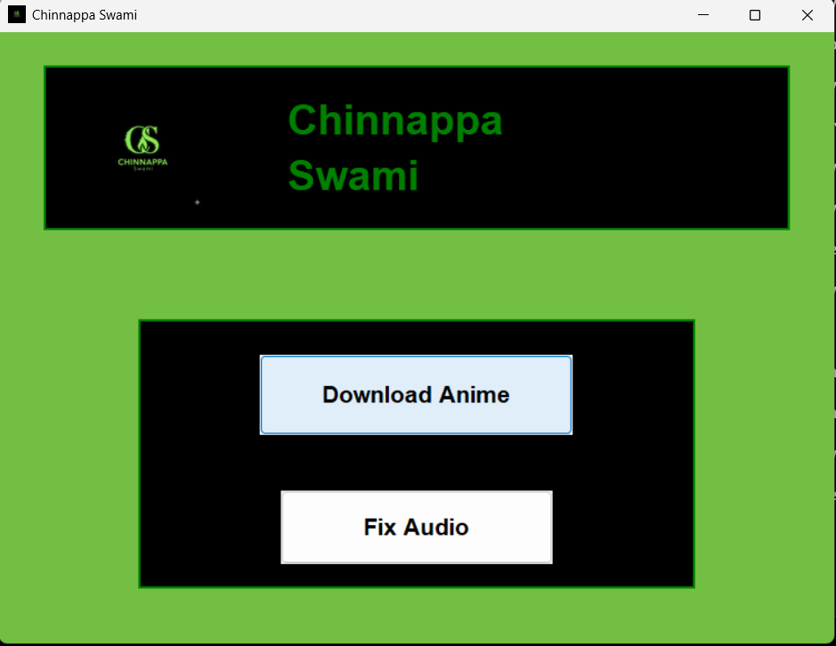
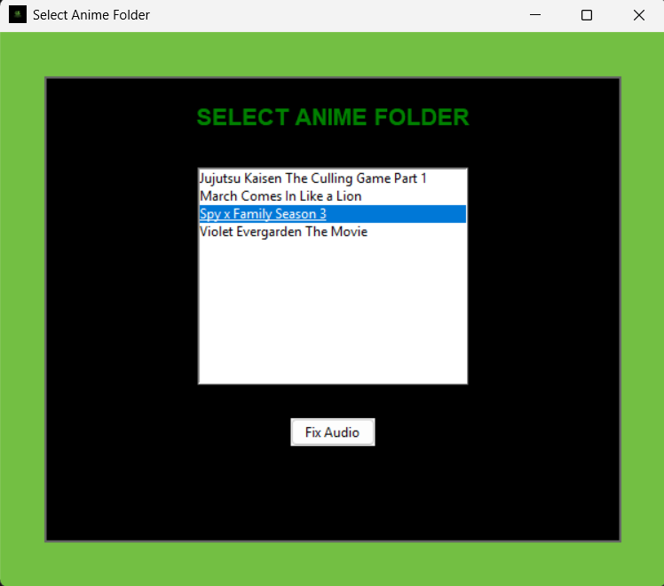

<p align="center">
  
</p>

<h1 align="center">🎌 Anime Launcher</h1>

<p align="center">
  <b>A sleek GUI launcher to download anime and fix audio issues — all in one click.</b>
</p>

<p align="center">
  
  
  
  
  
  
</p>

---

## 📖 About

**Anime Launcher** is a Windows desktop utility that provides a clean graphical interface for two core tasks — downloading anime via `animepahe-dl` and batch-fixing audio encoding issues in downloaded MP4 files using `ffmpeg`. Built with Python and Tkinter, it auto-installs dependencies and fires up PowerShell scripts in the background with zero hassle.

---

## ✨ Features

| Feature | Description |
|---|---|
| 🚀 **One-Click Download** | Launches `animepahe-dl` inside its virtual environment via PowerShell |
| 🔧 **Audio Fixer** | Batch re-encodes audio in MP4 files to AAC 192k using ffmpeg |
| 🗂️ **Folder Selector** | Browse and select any anime folder from your library for fixing |
| 🖼️ **Custom GUI** | Tkinter-based launcher with background image, logo, and styled buttons |
| 📦 **Auto Dependency Install** | Reads `Requirements.txt` and installs missing packages on startup |
| 🖥️ **Windowed Scripts** | Opens PowerShell scripts in a new console window for live feedback |

---

## 🛠️ Tech Stack

<table align="center">
  <tr>
    <td align="center" width="120">
      
      <br /><b>Python</b>
    </td>
    <td align="center" width="120">
      <br />🖥️<br /><b>Tkinter</b>
    </td>
    <td align="center" width="120">
      
      <br /><b>PowerShell</b>
    </td>
  </tr>
  <tr>
    <td align="center" width="120">
      <br />🖼️<br /><b>Pillow (PIL)</b>
    </td>
    <td align="center" width="120">
      <br />🎬<br /><b>ffmpeg</b>
    </td>
    <td align="center" width="120">
      <br />📥<br /><b>animepahe-dl</b>
    </td>
  </tr>
</table>

---

## 📁 Project Structure

```
Anime-Launcher/
│
├── launcher.py              # Main GUI application entry point
├── animepahe.ps1            # PowerShell script to activate venv & run animepahe-dl
├── fixing.ps1               # PowerShell script to batch-fix MP4 audio via ffmpeg
├── Requirements.txt         # Python dependencies (auto-installed on launch)
│
└── required_images/         # App assets
    ├── Logo.jpg             # Application logo / window icon
    └── Background_Image.jpg # GUI background image
```

---

## 🚀 Getting Started

### Prerequisites

- **Python 3.8+** installed on your system
- **Windows OS** (PowerShell required)
- **ffmpeg** installed and added to your system `PATH` (for the audio fix feature)
- **animepahe-dl** installed inside a Python virtual environment

### Installation

**1.** Clone the repository

```bash
git clone https://github.com/ChinnappaSwami/Anime-Launcher.git
cd Anime-Launcher
```

**2.** *(Optional)* Create and activate a virtual environment

```bash
python -m venv venv
venv\Scripts\activate
```

**3.** Install dependencies *(handled automatically on launch, or manually)*

```bash
pip install -r Requirements.txt
```

### Run the Application

```bash
python launcher.py
```

> 💡 **Tip:** Dependencies listed in `Requirements.txt` are auto-installed every time the launcher starts — no manual setup needed.

---

## ⚙️ Configuration

### Download Script (`animepahe.ps1`)

Update the `$venvPath` variable to point to your `animepahe-dl` virtual environment:

```powershell
$venvPath = "C:\Path\To\Your\animepahe-dl-venv"
```

### Audio Fix Script (`fixing.ps1`)

No configuration needed — the script automatically processes all `.mp4` files in the selected folder and saves fixed versions into a `fixed/` subfolder.

### Anime Library Path (`launcher.py`)

Update `BASE_ANIME_PATH` to your local anime directory:

```python
BASE_ANIME_PATH = r"C:\Users\YourName\Videos\Anime"
```

---

## 🖥️ How It Works

```
┌─────────────────┐
│  launcher.py    │  ← Python GUI (Tkinter)
│  (Main Window)  │
└────────┬────────┘
         │
    ┌────┴────┐
    │         │
    ▼         ▼
┌─────────┐  ┌──────────────────┐
│Download │  │   Fix Audio      │
│ Button  │  │   Button         │
└────┬────┘  └────────┬─────────┘
     │                │
     ▼                ▼
┌──────────────┐  ┌───────────────────┐
│animepahe.ps1 │  │ Folder Selector   │
│ Activates    │  │ (Listbox GUI)     │
│ venv &       │  └────────┬──────────┘
│ runs         │           │
│ animepahe-dl │           ▼
└──────────────┘  ┌───────────────────┐
                  │  fixing.ps1       │
                  │  Copies script &  │
                  │  batch-fixes      │
                  │  MP4 audio (AAC)  │
                  └───────────────────┘
```

1. **Launch** `launcher.py` — the main GUI window opens with two action buttons.
2. **Download Anime** — opens a new PowerShell console, activates the `animepahe-dl` venv, and runs the downloader interactively.
3. **Fix Audio** — opens a folder selector listing all anime folders in your library. Select a folder and click **Fix Audio**.
4. **fixing.ps1** is copied into the selected folder and executed — all `.mp4` files are re-encoded with proper AAC audio and saved to a `fixed/` subfolder.

---

---

## 📸 Screenshots

### 🎛️ Main Interface

<p align="center">
  
</p>

---

### 📥 Animepahe Downloader

<p align="center">
  
</p>

---

### 🔊 Audio Fixing

<p align="center">
  
</p>
---

## 📝 Requirements

| Package | Purpose |
|---|---|
| `pillow` | Loading and displaying GUI images (logo, background) |
| `ffmpeg` *(system)* | Re-encoding MP4 audio streams to AAC format |
| `animepahe-dl` *(venv)* | Downloading anime from AnimePahe |

---

## 🤝 Contributing

Contributions, issues, and feature requests are welcome!

1. **Fork** the repository
2. **Create** a feature branch (`git checkout -b feature/amazing-feature`)
3. **Commit** your changes (`git commit -m 'Add amazing feature'`)
4. **Push** to the branch (`git push origin feature/amazing-feature`)
5. **Open** a Pull Request

---

## 📄 License

This project is licensed under the **MIT License** — see the [LICENSE](LICENSE) file for details.

---

## 👤 Author

<p align="center">
  <b>ChinnappaSwami</b>
</p>

<p align="center">
  <a href="mailto:shreyasnayak0220@gmail.com">
    
  </a>
</p>

---

<p align="center">
  Made with ❤️ by <b>ChinnappaSwami</b>
</p>

<p align="center">
  ⭐ Star this repository if you found it helpful!
</p>